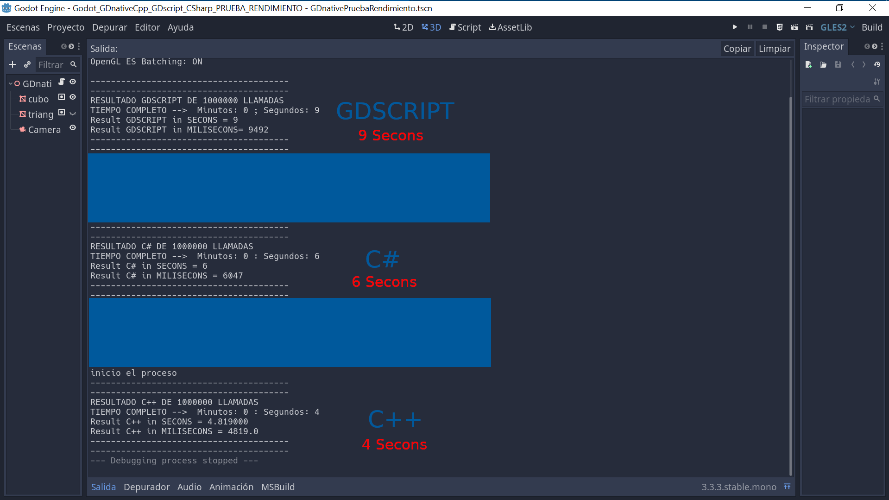

# PROYECTO PRUEBA RENDIMIENTO CON C++, GDSCRIPT y C#.

## ABRIR PROYECTO CON GODOT ENGINE C# para poder hacer todas las pruebas, sino solamente vas a poder hacer la de gdscript y C++

## Para saber como ejectuar el proyecto de C++ y cargar las librias mirar los siguientes tutoriales.

##  https://www.youtube.com/watch?v=5hmSGIQppSk&list=PLqsK8f12rhT8JXurR-gPYAYlaIvXkcB_H&index=13

## https://www.youtube.com/watch?v=p2jfUV8sjsk&list=PLqsK8f12rhT8JXurR-gPYAYlaIvXkcB_H&index=15

## Para probarlo Abri cada escena y ejecutalas por separado, veras en la consola los tiempos que tarda en llamar 1000000 de veces a funciones con nodos que se hacen visible y invisible. Tambien podes cambiar los valores y la cantidad de llamadas.

